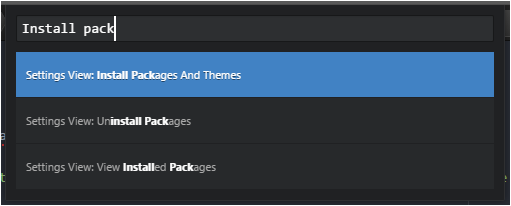
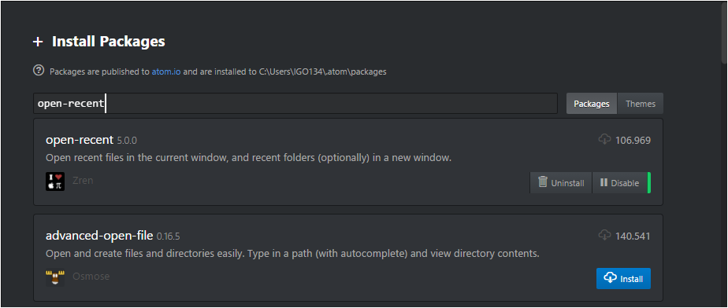
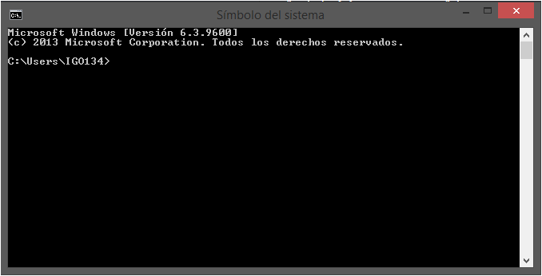
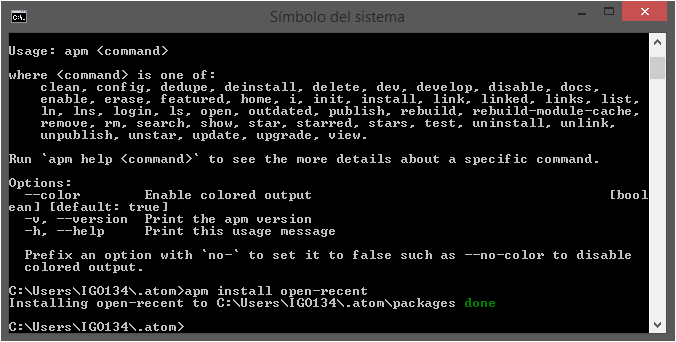

# Instalación de Add-Ons para Atom

Existen dos maneras de instalar Add-Ons en Atom.

* Puedes instalar paquetes accediendo a la configuracion de atom

  Presionando ``` ctrl + shift + P ``` y escribiendo ```Setting View: Install Package and Theme```

  

  Despues estaremos en la parte de instalacion de paquetes  

  


* Al igual puedes instalar paquetes por medio del simbolo del Sistema



  Nos dirigimos a la carpeta en de configuración de Atom

  ```
  cd  .atom
  apm install  %nombredelpaquete%
  ```


##[Anterior](PAGE2.md) ##[Siguiente](PAGE3.md)
##[Pagina principal](README.md)
