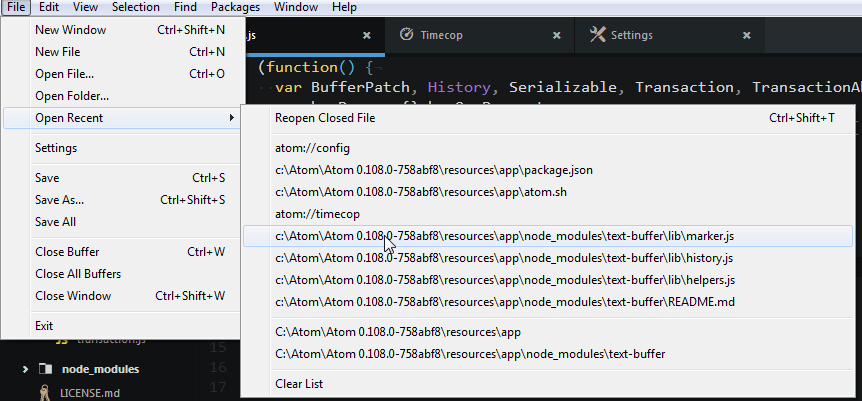
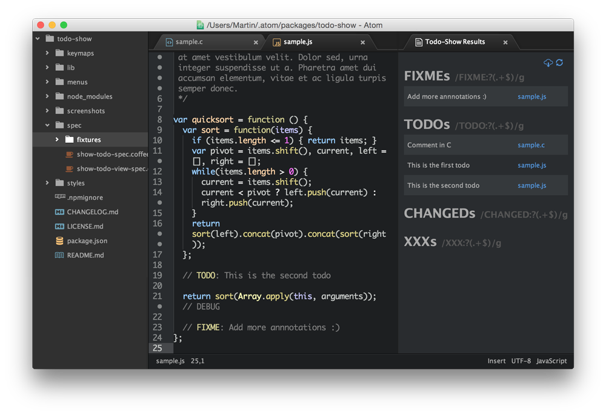

# Add-Ons para Atom

## Open Recent

  La paqueteria Open Recent simplemente habilita la opcion de abrir los archivos que se han abierto
  recientemente:

  

## TODO-Show

La paqueteria TODO-Show revela los comentarios hechos en los proyectos que contengan palabras clave como
`TODO`, `FIXME` y `CHANGED`, pero igual puedes poner tus propias palabras clave:

  

## Minimap
